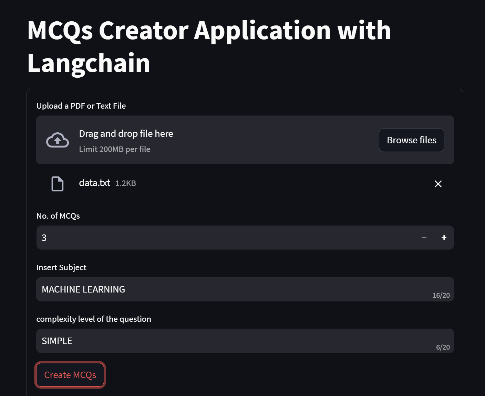

# MCQ Generator

MCQ Generator is a tool for automatically generating multiple-choice questions (MCQs) from raw text files or PDF documents.

## Features

- Parse text files and PDF documents to extract content.
- Generate MCQs based on the extracted content.
- Customize the number of questions, difficulty level, and subject of interest.
- Get options and correct answers for each generated question.
- User-friendly interface for ease of use.

